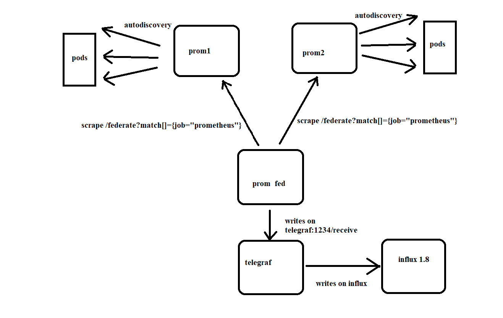

# prom-glows
# Prometheus federation

This assumes the following ips

3 prometheus running
 - 2 being on a slave setting
   - 172.17.0.6
   - 172.17.0.8
 - 1 as a federated that picks up metrics
   - 172.17.0.9

2 prometheus-avalanche metrics to fake sample metrics
 - 172.17.0.7
 - 172.17.0.5

1 influx db 1.8
 - 172.17.0.4

1 telegraf
 - 172.17.0.3

The connections are as follows


## Slave prometheus config

```
global:
  scrape_interval:     15s #Thoose are sample times, adjust for your kubernetes environtment
  evaluation_interval: 15s
alerting:
  alertmanagers:
  - static_configs:
    - targets:
rule_files:
scrape_configs: # For a kubernetes environtment, it will follow the standard autodiscovery rules and settings
  - job_name: 'prometheus-avalanche'
    static_configs:
    - targets: ['172.17.0.6:9001']
  - job_name: 'prometheus'
    static_configs:
    - targets: ['localhost:9090']
      labels:
        instance: 'prom2'

#remote_write:
#  - url: "http://172.17.0.3:1234/receive"

```

## Federated prometheus config

```
global:
  scrape_interval:     15s
  evaluation_interval: 15s
alerting:
  alertmanagers:
  - static_configs:
    - targets:
rule_files:
scrape_configs:
  - job_name: 'federate'
    scrape_interval: 15s

    honor_labels: true
    metrics_path: '/federate'

    params:
      'match[]':
        - '{job="prometheus"}' #MUST have a non-empty vector query

    static_configs: 
      - targets: ['172.17.0.6:9090'] # For kubernetes namespaces, the target is going to be service-name.namespace
        labels:
          instance: 'prom1'
      
      - targets: ['172.17.0.8:9090']
        labels:
          instance: 'prom2'


remote_write:
  - url: "http://172.17.0.3:1234/receive"

```
